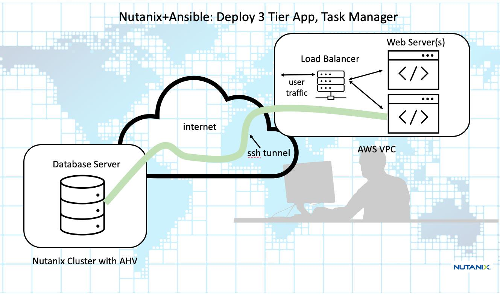
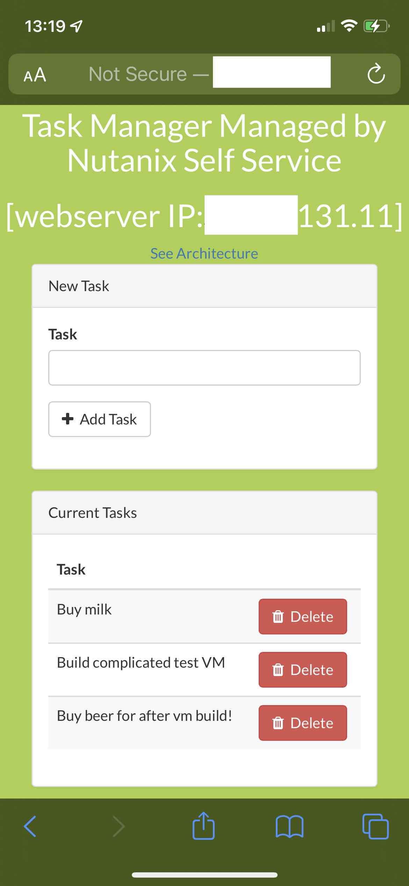

# ntnxAnsAws3tier
Ansible playbooks to deploy 3-tier Tasks Laravel web app with MySQL dbserver (on Nutanix AHV) and nginx web servers on AWS

<h2>Application Architecture</h2>

This 3 tier application, a webapp, is deployed with MySQL as the back-end database.  Two nginx servers make up the middle layer and the front-end loadbalancer is implemened using HAProxy.  The latter two layers are deployed onto AWS and the dtabase server is deployed onto a Nutanix AHV cluster.  The dtabase layer and the midle webserver layer communicate over an ssh tunnel - this menas there's no need for an AWS site-site vpn and one the app has been deployed any user anywhere from any device with a browser can enter the public IP address of the loadbalancer and get to the Task Manager webapp.

     
<h2>Application UI</h2>

